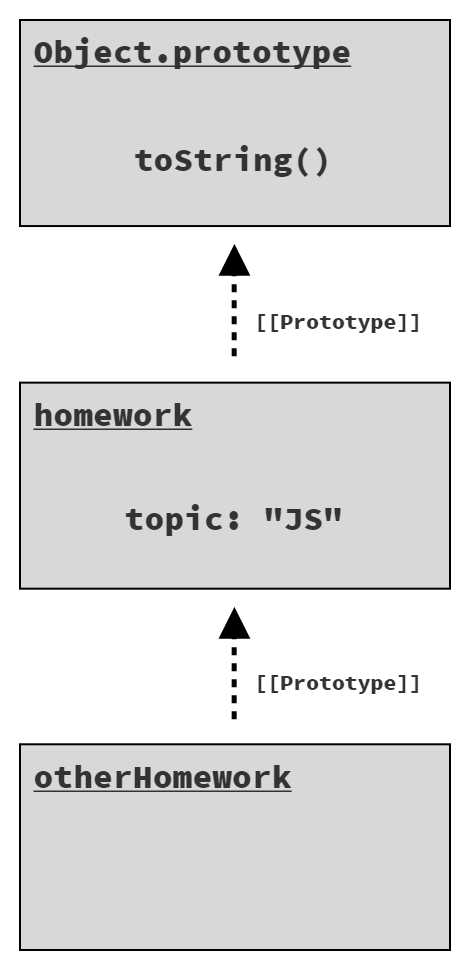
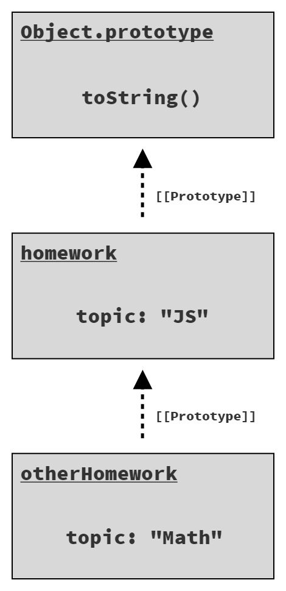
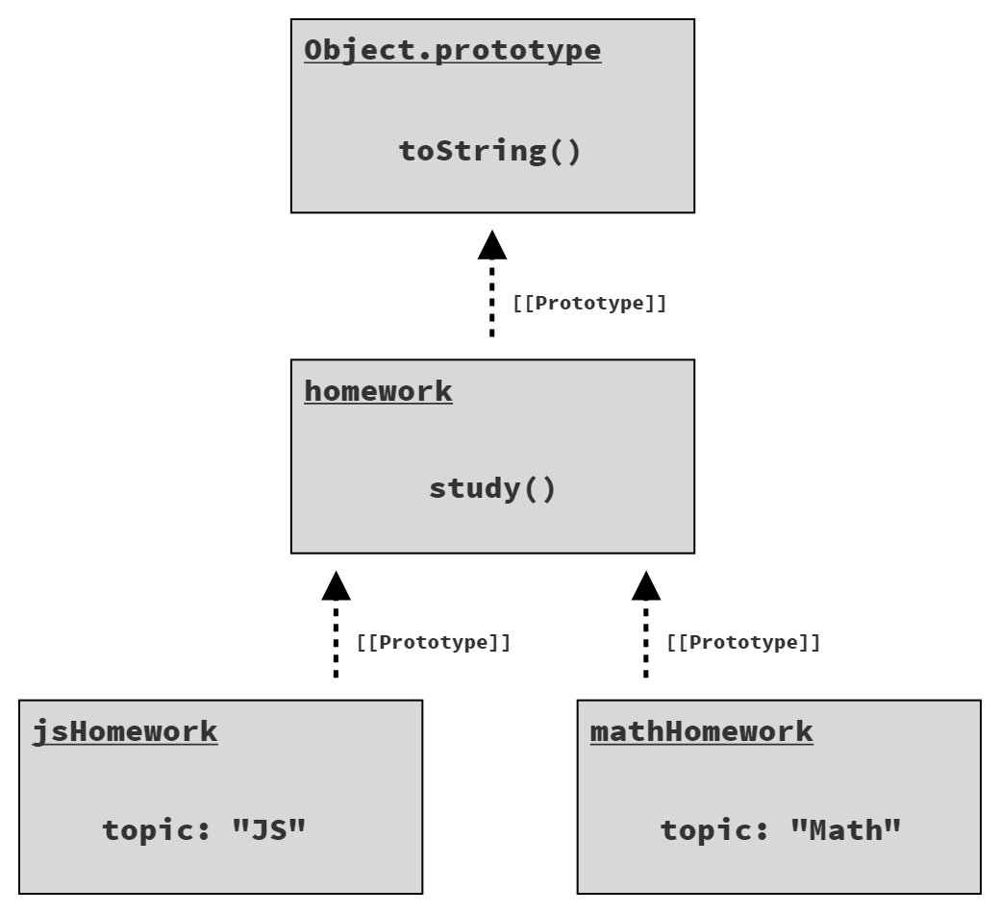

# You Don't Know JS Yet: Get Started - readaptation by handgull

# Capitolo 3: Scavando alle Radici di JS

Se hai letto i Capitoli 1 e 2 e hai dedicato del tempo a elaborare e assimilare, probabilmente stai cominciando a *capire* un po' meglio JS. Se li hai saltati/sfogliati (soprattutto il Capitolo 2), ti consiglio di tornare indietro e dedicare più tempo a quel materiale.

Nel Capitolo 2 abbiamo esaminato la sintassi, i pattern e i comportamenti a un livello elevato. In questo capitolo, la nostra attenzione si sposta su alcune delle caratteristiche di base di JS che sottendono virtualmente ogni riga di codice che scriviamo.

Sii consapevole: questo capitolo scava molto più in profondità di quanto sei abituato a pensare a un linguaggio di programmazione. Il mio obiettivo è aiutarti a comprendere il nucleo di come funziona JS, ciò che lo fa funzionare. Questo capitolo dovrebbe iniziare a rispondere a alcune delle domande "Perché?" che potrebbero sorgere mentre esplori JS. Tuttavia, questo materiale non è ancora un'esposizione esaustiva del linguaggio; a questo scopo c'è il resto della serie di libri! Il nostro obiettivo qui è ancora solo quello di *iniziare* e di diventare più familiari con la *sensazione* di JS, come scorre.

Non correre così velocemente attraverso questo materiale da perderti nei dettagli. Come ho già detto una dozzina di volte, **prenditi il tuo tempo**. Anche così, è probabile che finirai questo capitolo con domande rimanenti. E va bene, perché c'è tutta una serie di libri davanti a te per continuare a esplorare!

## Iterazione

Poiché i programmi sono essenzialmente costruiti per elaborare dati (e prendere decisioni su quei dati), i modelli utilizzati per attraversare i dati hanno un grande impatto sulla leggibilità del programma.

Il pattern dell'iteratore è esistito per decenni e suggerisce un approccio "standardizzato" per consumare i dati da una fonte un *pezzo* alla volta. L'idea è che sia più comune e utile iterare la fonte dei dati - gestire progressivamente la raccolta di dati elaborando la prima parte, poi la successiva e così via, piuttosto che gestire l'intero set in una volta sola.

Immagina una struttura dati che rappresenta una query `SELECT` di un database relazionale, che tipicamente organizza i risultati come righe. Se questa query avesse una o un paio di righe, potresti gestire l'intero set di risultati in una volta sola, assegnando ciascuna riga a una variabile locale e eseguendo le operazioni appropriate su quei dati.

Ma se la query ha 100 o 1.000 (o più!) righe, avrai bisogno di un'elaborazione iterativa per gestire questi dati (tipicamente, un ciclo).

Il pattern dell'iteratore definisce una struttura dati chiamata "iteratore" che ha un riferimento a una fonte dati sottostante (come le righe dei risultati della query), che espone un metodo come `next()`. Chiamare `next()` restituisce il prossimo pezzo di dati (cioè un "record" o una "riga" da una query di database).

Non sai sempre quanti pezzi di dati avrai bisogno di attraversare, quindi il pattern indica tipicamente il completamento mediante un valore speciale o un'eccezione una volta che hai iterato l'intero set e *superato la fine*.

L'importanza del pattern dell'iteratore sta nel rispettare un modo *standard* di elaborare i dati in modo iterativo, che crea codice più pulito e facile da capire, rispetto al fatto che ogni struttura/sorgente dati definisca il proprio modo personalizzato di gestire i dati.

Dopo molti anni di sforzi della comunità JS intorno a tecniche di iterazione concordate reciprocamente, ES6 ha standardizzato un protocollo specifico per il pattern dell'iteratore direttamente nel linguaggio. Il protocollo definisce un metodo `next()` il cui ritorno è un oggetto chiamato *risultato dell'iteratore*; l'oggetto ha proprietà `value` e `done`, dove `done` è un booleano che è `false` fino a quando l'iterazione sulla fonte dati sottostante è completata.

### Consumare gli Iteratori
Con il protocollo di iterazione ES6 in atto, è possibile consumare una fonte di dati un valore alla volta, controllando dopo ogni chiamata a `next()` che done sia `true` per interrompere l'iterazione. Ma questo approccio è piuttosto manuale, quindi ES6 ha incluso anche diversi meccanismi (sintassi e API) per il consumo standardizzato di questi iteratori.

Uno di questi meccanismi è il ciclo `for..of`:

```js
// given an iterator of some data source:
var it = /* .. */;

// loop over its results one at a time
for (let val of it) {
    console.log(`Iterator value: ${ val }`);
}
// Iterator value: ..
// Iterator value: ..
// ..
```

> Ometteremo qui l'equivalente del ciclo manuale, ma è sicuramente meno leggibile rispetto al ciclo `for..of`!

Un altro meccanismo spesso utilizzato per consumare gli iteratori è l'operatore `...`. Questo operatore ha effettivamente due forme simmetriche: spread e rest (o gather, come preferisco). La forma spread è un consumatore di iteratori.

Per spreadare un iteratore, è necessario avere qualcosa in cui diffonderlo. Ci sono due possibilità in JavaScript: un array o un elenco di argomenti per una chiamata di funzione.

Un array spread:

```js
// spread di un iteratore in un array,
// con ogni valore iterato che occupa
// una posizione nell'array.
var vals = [...it];
```

Uno spread in una chiamata di funzione:

```js
// spread di un iteratore in una funzione,
// chiamata con ogni valore iterato
// che occupa una posizione di argomento.
faiQualcosaDiUtile(...it);
```

In entrambi i casi, la forma di spread dell'iteratore `...` segue il protocollo di consumo dell'iteratore (lo stesso del ciclo `for..of`) per recuperare tutti i valori disponibili da un iteratore e posizionarli (detto anche spread) nel contesto di ricezione (array, elenco di argomenti).

### Iterables
Il protocollo di consumo dell'iteratore è tecnicamente definito per consumare gli iterabili; un iterabile è un valore su cui è possibile iterare.

Il protocollo crea automaticamente un'istanza di iteratore da un iterabile e consuma solo quella specifica istanza di iteratore fino al completamento. Ciò significa che un singolo iterabile potrebbe essere consumato più di una volta; ogni volta verrebbe creata e utilizzata una nuova istanza di iteratore.

Dove possiamo trovare gli iterabili?

ES6 ha definito i tipi di base delle strutture/delle collezioni in JS come iterabili. Questo include stringhe, array, mappe, set e altri.

Considera:

```js
// un array è un iterabile
var arr = [10, 20, 30];

for (let val of arr) {
    console.log(`Valore dell'array: ${val}`);
}
// Valore dell'array: 10
// Valore dell'array: 20
// Valore dell'array: 30
```

Poiché gli array sono iterabili, possiamo copiare superficialmente un array usando il consumo dell'iteratore tramite l'operatore di spread `...`:

```js
var arrCopy = [...arr];
```

Possiamo anche iterare i singoli caratteri in una stringa uno alla volta:

```js
var greeting = "Ciao mondo!";
var chars = [...greeting];

chars;
// [ "C", "i", "a", "o", " ", "m", "o", "n", "d", "o", "!" ]
```

Una struttura dati `Map` utilizza gli oggetti come chiavi, associando un valore (di qualsiasi tipo) a quell'oggetto. Le mappe hanno una iterazione predefinita diversa da quella vista qui, poiché l'iterazione non riguarda solo i valori della mappa, ma piuttosto le sue entry. Una entry è una tupla (array a 2 elementi) che include sia una chiave che un valore.

```js
// dato due elementi del DOM, `btn1` e `btn2`

var nomiPulsanti = new Map();
nomiPulsanti.set(btn1, "Pulsante 1");
nomiPulsanti.set(btn2, "Pulsante 2");

for (let [btn, nomePulsante] of nomiPulsanti) {
    btn.addEventListener("click", function onClick() {
        console.log(`Cliccato ${nomePulsante}`);
    });
}
```

Nel ciclo `for..of` sull'iterazione predefinita della mappa, utilizziamo la sintassi [btn, nomePulsante] (chiamata "destrutturazione di array") per decomporre ogni tupla consumata nei rispettivi coppie chiave/valore.

Ciascuno degli iterabili integrati in JS espone un'iterazione predefinita, che probabilmente corrisponde alla tua intuizione. Ma puoi anche scegliere un'iterazione più specifica se necessario. Ad esempio, se vogliamo consumare solo i valori della mappa nomiPulsanti sopra, possiamo chiamare values() per ottenere un iteratore solo per i valori:

```js
for (let btnName of buttonNames.values()) {
    console.log(btnName);
}
// Button 1
// Button 2
```

Oppure, se vogliamo l'indice e il valore in un'iterazione di un array, possiamo creare un iteratore di entries con il metodo `entries()`:

```js
var arr = [ 10, 20, 30 ];

for (let [idx,val] of arr.entries()) {
    console.log(`[${ idx }]: ${ val }`);
}
// [0]: 10
// [1]: 20
// [2]: 30
```

Per la maggior parte, tutti gli iterabili integrati in JS hanno tre forme di iteratori disponibili: solo chiavi (keys()), solo valori (values()) e entries (entries()).

Oltre all'uso degli iterabili integrati, puoi anche garantire che le tue strutture dati personali aderiscano al protocollo di iterazione; farlo significa aderire alla capacità di consumare i tuoi dati con i cicli for..of e l'operatore `...`. "Standardizzare" su questo protocollo significa avere codice globalmente più facilmente riconoscibile e leggibile.

| NOTA: |
| :--- |
| Potresti aver notato uno spostamento sottile avvenuto in questa discussione. Abbiamo iniziato parlando del consumo di iteratori, ma poi abbiamo iniziato a parlare dell'iterazione sugli iterabili. Il protocollo di consumo dell'iterazione richiede un iterabile, ma il motivo per cui possiamo fornire direttamente un iteratore è che un iteratore è di per sé un iterabile! Quando si crea un'istanza di iteratore da un iteratore esistente, l'iteratore stesso viene restituito.

## Chiusura (Closure)
Forse senza rendersene conto, quasi ogni sviluppatore JS ha fatto uso delle closure. Di fatto, la chiusura è una delle funzionalità di programmazione più pervasiva in una maggior parte di linguaggi. Potrebbe persino essere importante capirla tanto quanto le variabili o i cicli; è così fondamentale.

Eppure sembra un po' nascosta, quasi magica. Spesso viene descritta in termini molto astratti o informali, cosa che fa poco per aiutarci a capire esattamente di cosa si tratta.

Abbiamo bisogno di riconoscere dove la chiusura viene utilizzata nei programmi, poiché la presenza o l'assenza di chiusura è talvolta la causa di bug (o addirittura di problemi di prestazioni).

Quindi definiamo la chiusura in modo pragmatico e concreto:

> **La closure è quando una funzione ricorda e continua ad accedere alle variabili al di fuori del suo scope, anche quando la funzione viene eseguita in uno scope diverso da quello in cui è stata originariamente definita.**

Vediamo due caratteristiche definitorie qui. Innanzitutto, la chiusura fa parte della natura di una funzione. Gli oggetti non ottengono closure, solo le funzioni. In secondo luogo, per osservare una closure, è necessario eseguire una funzione in uno scope diverso da quello in cui quella funzione è stata originariamente definita.

```js
function greeting(msg) {
    return function who(name) {
        console.log(`${ msg }, ${ name }!`);
    };
}

var hello = greeting("Hello");
var howdy = greeting("Howdy");

hello("Kyle");
// Hello, Kyle!

hello("Sarah");
// Hello, Sarah!

howdy("Grant");
// Howdy, Grant!
```

Prima di tutto, la funzione esterna `greeting(..)` viene eseguita, creando un'istanza della funzione interna `who(..)`; quella funzione chiude sulla variabile msg, che è il parametro dello scope esterno di `greeting(..)`. Quando quella funzione interna viene restituita, il suo riferimento viene assegnato alla variabile hello nello scope esterno. Quindi chiamiamo `greeting(..)` una seconda volta, creando una nuova istanza della funzione interna, con una nuova chiusura su un nuovo msg, e restituiamo quel riferimento per essere assegnato a `howdy`.

Quando la funzione `greeting(..)` finisce di eseguirsi, normalmente ci si aspetterebbe che tutte le sue variabili vengano eliminate dalla memoria. Ci aspetteremmo che ogni msg vada via, ma non è così. Il motivo è la chiusura. Poiché le istanze delle funzioni interne sono ancora vive (assegnate rispettivamente a hello e howdy), le loro chiusure stanno ancora preservando le variabili msg.

Queste chiusure non sono uno snapshot del valore della variabile msg; sono un collegamento diretto e la preservazione della variabile stessa. Ciò significa che la chiusura può effettivamente osservare (o effettuare!) aggiornamenti a queste variabili nel tempo.

```js
function counter(step = 1) {
    var count = 0;
    return function increaseCount(){
        count = count + step;
        return count;
    };
}

var incBy1 = counter(1);
var incBy3 = counter(3);

incBy1();       // 1
incBy1();       // 2

incBy3();       // 3
incBy3();       // 6
incBy3();       // 9
```

Ogni istanza della funzione interna `increaseCount()` chiude sia le variabili `count` che `step` dallo scope esterno della funzione `counter(..)`. `step` rimane lo stesso nel tempo, ma `count` viene aggiornato ad ogni invocazione di quella funzione interna. Poiché la chiusura riguarda le variabili e non solo gli snapshot dei valori, questi aggiornamenti vengono preservati.

Le closure sono più comuni quando si lavora con codice asincrono, come con i callback. Considera:

```js
function getSomeData(url) {
    ajax(url,function onResponse(resp){
        console.log(
            `Response (from ${ url }): ${ resp }`
        );
    });
}

getSomeData("https://some.url/wherever");
// Response (from https://some.url/wherever): ...
```

La funzione interna `onResponse(..)` chiude su `url` e quindi lo preserva e lo ricorda fino a quando la chiamata Ajax torna ed esegue `onResponse(..)`. Anche se `getSomeData(..)` finisce subito, la variabile del parametro `url` rimane viva nella chiusura per tutto il tempo necessario.

Non è necessario che lo scope esterno sia una funzione, di solito lo è, ma non sempre, è sufficiente che ci sia almeno una variabile in uno scope esterno a cui si accede da una funzione interna:

```js
for (let [idx,btn] of buttons.entries()) {
    btn.addEventListener("click",function onClick(){
       console.log(`Clicked on button (${ idx })!`);
    });
}
```

Poiché questo ciclo usa dichiarazioni let, ogni iterazione ottiene nuove variabili idx e btn bloccate nello scope del blocco (chiamato locale); il ciclo crea anche una nuova funzione interna `onClick(..)` ogni volta. Quella funzione interna chiude su `idx`, preservandolo per tutto il tempo in cui l'handler del click è impostato sul `btn`. Quindi, quando viene cliccato ogni pulsante, il suo handler può stampare il valore dell'indice associato, perché l'handler ricorda la variabile `idx` corrispondente.

Ricorda: questa chiusura non è sul valore (come 1 o 3), ma sulla variabile idx stessa.

La chiusura è uno dei pattern di programmazione più diffusi e importanti in qualsiasi linguaggio. Ma questo è particolarmente vero per JS; è difficile immaginare di fare qualcosa di utile senza sfruttare la chiusura in un modo o nell'altro.

Se hai ancora dubbi o ti senti incerto sulla chiusura, la maggior parte del Libro 2, Scope & Closures, è incentrata sull'argomento.

## Parola chiave 'this'

Uno dei meccanismi più potenti di JavaScript è anche uno dei più fraintesi: la parola chiave `this`. Un fraintendimento comune è che il `this` di una funzione si riferisca alla funzione stessa. A causa del funzionamento del `this` in altri linguaggi, un altro fraintendimento è che `this` punti all'istanza a cui appartiene un metodo. Entrambe le affermazioni sono errate.

Come discusso in precedenza, quando una funzione viene definita, essa è associata al suo scope circostante tramite chiusura. Lo scope è l'insieme di regole che controlla come vengono risolte le referenze alle variabili.

Ma le funzioni hanno anche un'altra caratteristica oltre al loro scope che influisce su ciò a cui possono accedere. Questa caratteristica è meglio descritta come un contesto di esecuzione, ed è resa disponibile alla funzione tramite la sua parola chiave `this`.

Lo scope è statico e contiene un insieme fisso di variabili disponibili nel momento e nel luogo in cui si definisce una funzione, ma il contesto di esecuzione di una funzione è dinamico, dipendente interamente da come viene chiamata (indipendentemente da dove è stata definita o persino chiamata).

`this` non è una caratteristica fissa di una funzione basata sulla definizione della funzione stessa, ma piuttosto una caratteristica dinamica che viene determinata ogni volta che la funzione viene chiamata.

Un modo per pensare al contesto di esecuzione è che è un oggetto tangibile le cui proprietà sono rese disponibili a una funzione mentre essa si esegue. Confrontalo con lo scope, che può anche essere pensato come un oggetto; tuttavia, l'oggetto di scope è nascosto all'interno del motore JavaScript, è sempre lo stesso per quella funzione e le sue proprietà assumono la forma di variabili identificative disponibili all'interno della funzione.

```js
function aula(insegnante) {
    return function studio() {
        console.log(
            `${insegnante} dice di studiare ${this.argomento}`
        );
    };
}
var compito = aula("Kyle");
```

La funzione esterna `aula(..)` non fa riferimento a una parola chiave `this`, quindi è come qualsiasi altra funzione che abbiamo visto finora. Ma la funzione interna `studio()` fa riferimento a `this`, il che la rende una funzione consapevole di `this`. In altre parole, è una funzione che dipende dal suo contesto di esecuzione.

> `studio()` chiude anche la variabile insegnante dal suo scope esterno.

La funzione interna `studio()` restituita da `aula("Kyle")` viene assegnata a una variabile chiamata compito. Quindi come può essere chiamata compito() (alias studio())?

```js
compito();
// Kyle dice di studiare undefined  -- Ops :(
```

In questo frammento, chiamiamo compito() come una normale funzione, senza fornirgli alcun contesto di esecuzione.

Poiché questo programma non è in strict mode (vedi Capitolo 1), le funzioni consapevoli di contesto che vengono chiamate senza alcun contesto specificato impostano di default il contesto sull'oggetto globale (window nel browser). Poiché non c'è una variabile globale chiamata argomento (e quindi nessuna proprietà corrispondente sull'oggetto globale), this.argomento si risolve a `undefined`.

Ora considera:

```js
var compiti = {
    argomento: "JS",
    compito: compito
};

compiti.compito();
// Kyle dice di studiare JS
```

Una copia del riferimento della funzione `compito` è impostata come proprietà sull'oggetto `compiti`, e poi viene chiamata come `compiti.compito()`. Ciò significa che il `this` per quella chiamata di funzione sarà l'oggetto `compiti`. Quindi, `this.argomento` si risolve a "JS".

Infine:

```js
var altroCompito = {
    argomento: "Matematica"
};

compito.call(altroCompito);
// Kyle dice di studiare Matematica
```

Un terzo modo per invocare una funzione è con il metodo `call(..)`, che prende un oggetto (altroCompito qui) da utilizzare per impostare il riferimento this per la chiamata della funzione. Il riferimento alla proprietà this.argomento si risolve a "Matematica".

La stessa funzione consapevole di `this`, invocata in tre modi diversi, fornisce risposte diverse ogni volta per quale oggetto il `this` farà riferimento.

Il vantaggio delle funzioni consapevoli di `this` e del loro **contesto dinamico** è la capacità di riutilizzare in modo più flessibile una singola funzione con dati provenienti da oggetti diversi. Una funzione che chiude uno scope non può mai fare riferimento a un diverso scope o a un diverso insieme di variabili. Ma una funzione che ha una consapevolezza dinamica del contesto di this può essere molto utile per determinati compiti.

## Prototipi

Dove `this` è una caratteristica dell'esecuzione della funzione, un prototipo è una caratteristica di un oggetto e specificamente della risoluzione di un accesso alla proprietà.

Pensa a un prototipo come a un collegamento tra due oggetti; il collegamento è nascosto dietro le quinte, anche se ci sono modi per esporlo e osservarlo. Questo collegamento del prototipo avviene quando un oggetto viene creato; è collegato a un altro oggetto che esiste già.

Una serie di oggetti collegati tramite prototipi è chiamata "catena dei prototipi".

Lo scopo di questo collegamento del prototipo (cioè da un oggetto B a un altro oggetto A) è che gli accessi a B per proprietà/metodi che B non possiede vengono delegati ad A per gestirli. La delega dell'accesso alle proprietà/metodi consente a due (o più!) oggetti di cooperare tra loro per eseguire un compito.

Considera la definizione di un oggetto come un letterale normale:

```js
var homework = {
    topic: "JS"
};
```

L'oggetto `homework` ha solo una singola proprietà: `topic`. Tuttavia, il suo collegamento predefinito al prototipo si connette all'oggetto Object.prototype, che ha metodi incorporati comuni come toString() e valueOf(), tra gli altri.

Possiamo osservare questa delega di collegamento del prototipo da compito a Object.prototype:

```js
homework.toString();    // [object Object]
```

`homework.toString()` funziona anche se homework non ha un metodo toString() definito; la delega invoca invece Object.prototype.toString().

### Collegamento degli Oggetti
Per definire un collegamento del prototipo di un oggetto, puoi creare l'oggetto usando l'utilità `Object.create(..)`:

```js
var homework = {
    topic: "JS"
};

var otherHomework = Object.create(homework);

otherHomework.topic;   // "JS"
```

Il primo argomento di `Object.create(..)` specifica un oggetto a cui collegare il nuovo oggetto creato, e quindi restituisce il nuovo oggetto creato (e collegato!).

<figure>
    
    <figcaption><em>Fig. 1: Objects in a prototype chain</em></figcaption>
    <br><br>
</figure>

La delega attraverso la catena del prototipo si applica solo per gli accessi per cercare il valore di una proprietà. Se assegni a una proprietà di un oggetto, ciò si applicherà direttamente all'oggetto indipendentemente da dove quell'oggetto è collegato tramite prototipo.

| SUGGERIMENTO: |
| :--- |
| `Object.create(null)` crea un oggetto che non è collegato a nessun prototipo, quindi è semplicemente un oggetto autonomo; in alcune circostanze, potrebbe essere preferibile.

```js
homework.topic;
// "JS"

otherHomework.topic;
// "JS"

otherHomework.topic = "Math";
otherHomework.topic;
// "Math"

homework.topic;
// "JS" -- not "Math"
```

L'assegnazione a `topic` crea una proprietà con quel nome direttamente su `otherHomework`; non ha alcun effetto sulla proprietà `topic` sull'oggetto `homework`. La dichiarazione successiva accede quindi a `otherHomework.topic`, e vediamo la risposta non delegata da quella nuova proprietà: "Math".

<figure>
    
    <figcaption><em>Fig. 2: Shadowed property 'topic'</em></figcaption>
    <br><br>
</figure>

Il topic su otherHomework sta "oscurando" la proprietà dello stesso nome sull'oggetto compito nella catena.

| NOTA: |
| :--- |
| Un altro modo francamente più complicato ma forse ancora più comune di creare un oggetto con un collegamento del prototipo è utilizzare il modello di "classe prototipale", precedente a class (vedi Capitolo 2, "Classi") che è stato aggiunto in ES6. Affronteremo questo argomento in dettaglio nell'Appendice A, "Classi Prototipali".

### `this` Rivisitato
Abbiamo affrontato in precedenza la parola chiave `this`, ma la sua vera importanza emerge quando si considera come essa alimenta le chiamate di funzioni delegate tramite il prototipo. Infatti, una delle principali ragioni per cui `this` supporta un contesto dinamico basato su come viene chiamata la funzione è per consentire alle chiamate di metodo sugli oggetti che delegano tramite la catena del prototipo di mantenere comunque il `this` previsto.

```js
var homework = {
    study() {
        console.log(`Please study ${ this.topic }`);
    }
};

var jsHomework = Object.create(homework);
jsHomework.topic = "JS";
jsHomework.study();
// Please study JS

var mathHomework = Object.create(homework);
mathHomework.topic = "Math";
mathHomework.study();
// Please study Math
```

I due oggetti `jsHomework` e `mathHomework` sono entrambi collegati tramite prototipo all'unico oggetto compito, che ha la funzione `study()`. A ciascuno di essi viene assegnata la propria proprietà argomento (vedi Figura 3).

<figure>
    
    <figcaption><em>Fig. 3: Two objects linked to a common parent</em></figcaption>
    <br><br>
</figure>

`jsHomework.study()` delega a `homework.study()`, ma il suo this (this.argomento) per quell'esecuzione si risolve a `jsHomework` a causa del modo in cui la funzione è chiamata, quindi `this.topic` è "JS". Analogamente per `mathHomework.study()` che delega a `homework.study()` ma risolve comunque this a `mathHomework`, e quindi this.argomento risulta "Math".

Il codice precedente sarebbe molto meno utile se this si risolvesse a `homework`. Tuttavia, in molti altri linguaggi sembrerebbe che `this` sia `homework` perché il metodo `study()` è effettivamente definito su `homework`.

A differenza di molti altri linguaggi, il fatto che `this` in JavaScript sia dinamico è un componente critico che consente alla delega del prototipo, e di fatto anche alle classi, di funzionare come previsto!