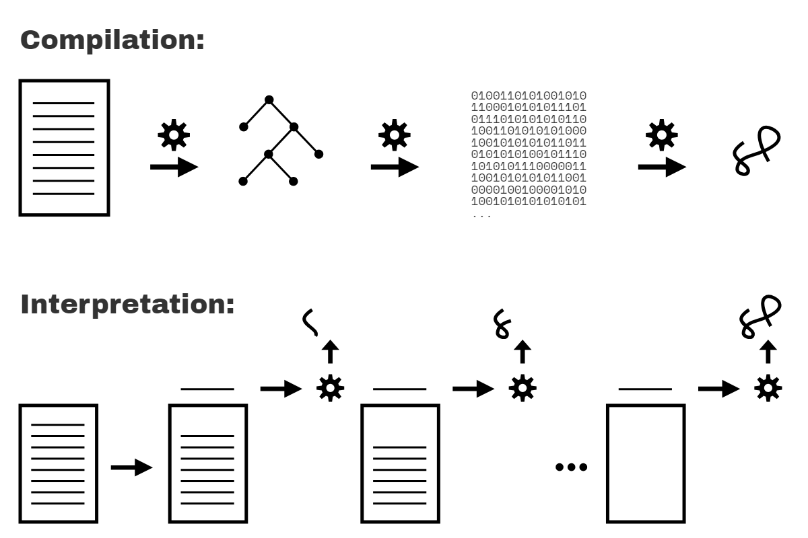

# You Don't Know JS Yet: Scope & Closures - readaptation by handgull

# Capitolo 1: Cos'è lo Scope?
Quando hai scritto i tuoi primi programmi, è probabile che ti sia abbastanza familiarizzato con la creazione di variabili e il salvataggio di valori al loro interno. Lavorare con le variabili è una delle attività fondamentali nella programmazione!

Tuttavia, potresti non aver considerato molto da vicino i meccanismi sottostanti utilizzati dal motore per organizzare e gestire queste variabili. Non intendo come viene allocata la memoria sul computer, ma piuttosto: come fa JavaScript a sapere quali variabili sono accessibili da una data istruzione e come gestisce due variabili dello stesso nome?

Le risposte a domande come queste prendono la forma di regole ben definite chiamate "scope". Questo libro esplorerà tutti gli aspetti dello scope: come funziona, a cosa serve, gli errori da evitare e indicherà i modelli comuni di scope che guidano la struttura dei programmi.

Il nostro primo passo è scoprire come il motore JavaScript elabora il nostro programma **prima** che venga eseguito.

## Riguardo a Questo Libro
Benvenuti nel secondo libro della serie *You Don't Know JS Yet*! Se hai già completato *Get Started* (il primo libro), sei nel posto giusto! Se non lo hai fatto, ti incoraggio a *cominciare da lì* per avere una solida base.

Il nostro focus sarà sul primo dei tre pilastri del linguaggio JS: il sistema di scope e le sue closure di funzioni, così come la potenza del pattern di design dei moduli.

JS è tipicamente classificato come linguaggio di scripting interpretato, quindi la maggior parte assume che i programmi JS siano processati in un singolo passaggio dall'alto verso il basso. Ma in realtà JS viene analizzato/compilato in una fase separata **prima che inizi l'esecuzione**. Le decisioni dell'autore del codice su dove posizionare variabili, funzioni e blocchi rispetto agli altri vengono analizzate secondo le regole dello scope, durante la fase iniziale di analisi/compilazione. La struttura di scope risultante è generalmente indipendente dalle condizioni di runtime.

Le funzioni JS sono esse stesse valori di prima classe; possono essere assegnate e passate intorno come numeri o stringhe. Ma poiché queste funzioni contengono e accedono variabili, mantengono il loro scope originale non importa dove nel programma vengano alla fine eseguite le funzioni stesse. Questo fenomeno è chiamato closure.

I moduli sono un pattern di organizzazione del codice caratterizzato da metodi pubblici che hanno accesso privilegiato (tramite closure) a variabili e funzioni nascoste nello scope interno del modulo.

## Compilato vs Interpretato
Forse hai sentito parlare della *compilazione del codice* in precedenza, ma può sembrare un misterioso scrigno nero in cui il codice sorgente entra da un'estremità e i programmi eseguibili escono dall'altra.

In realtà non è né misterioso né magico. La compilazione del codice è una serie di passaggi che elaborano il testo del tuo codice e lo trasformano in una lista di istruzioni comprensibili dal computer. Tipicamente, l'intero codice sorgente viene trasformato in una sola volta e le istruzioni risultanti vengono salvate in uscita (solitamente in un file) che può essere eseguito successivamente.

Forse hai anche sentito che il codice può essere *interpretato*, ma qual è la differenza rispetto alla *compilazione*?

L'interpretazione svolge un compito simile alla compilazione nel trasformare il tuo programma in istruzioni comprensibili dalla macchina. Ma il modello di elaborazione è diverso. A differenza di un programma compilato tutto in una volta, con l'interpretazione il codice sorgente viene trasformato linea per linea; ogni linea o istruzione viene eseguita prima di procedere immediatamente all'elaborazione della linea successiva del codice sorgente.

<figure>
    
    <figcaption><em>Fig. 1: Compilato vs. Interpretato</em></figcaption>
    <br><br>
</figure>

La Figura 1 illustra la compilazione rispetto all'interpretazione dei programmi.

Questi due modelli di elaborazione sono mutuamente esclusivi? In generale, sì. Tuttavia, la questione è più sfumata, perché l'interpretazione può assumere forme diverse rispetto alla semplice esecuzione linea per linea del testo del codice sorgente. Gli attuali motori JS utilizzano numerose variazioni sia della compilazione che dell'interpretazione nella gestione dei programmi JS.

Ricorda che abbiamo esaminato questo argomento nel Capitolo 1 del libro *Get Started*. La nostra conclusione era che JS è rappresentato più accuratamente come un **linguaggio compilato**. Per il beneficio dei lettori qui, le sezioni seguenti rivedranno ed espanderanno su tale affermazione. (handgull: io nel primo libro avevo un po rivisitato questa parte, scrivendo a grandi linee quello che vedremo qui... tecnicamente è più corretto definire JS come interpretato)

## Compilazione del Codice
Ma prima, perché importa se JS viene compilato o meno?

Lo scope è determinato principalmente durante la compilazione, quindi capire come la compilazione e l'esecuzione sono correlate è fondamentale per padroneggiare lo scope.

Nella teoria classica dei compilatori, un programma viene elaborato da un compilatore in tre fasi di base:

1. **Tokenizzazione/Lessicalizzazione:** suddivisione di una stringa di caratteri in parti significative (per il linguaggio), chiamate token. Ad esempio, considera il programma: `var a = 2;`. Questo programma verrebbe probabilmente suddiviso nei seguenti token: `var`, `a`, `=`, `2` e `;`. Gli spazi vuoti possono essere o meno conservati come token, a seconda se sono significativi o meno.

    (La differenza tra tokenizzazione e lessicalizzazione è sottile e accademica, ma riguarda il modo in cui questi token vengono identificati in modo *stateless* o *stateful*. In parole semplici, se il tokenizer dovesse utilizzare regole di parsing stateful per capire se `a` dovrebbe essere considerato un token distinto o solo parte di un altro token, *questo* sarebbe **lessicalizzazione**.)

2. **Parsing:** prendere una serie (array) di token e trasformarla in un albero di elementi nidificati, che rappresentano collettivamente la struttura grammaticale del programma. Questo è chiamato Albero di Sintassi Astratta (AST).

    Ad esempio, l'albero per `var a = 2;` potrebbe iniziare con un nodo di primo livello chiamato `VariableDeclaration`, con un nodo figlio chiamato `Identifier` (il cui valore è `a`), e un altro nodo chiamato `AssignmentExpression` che ha a sua volta un nodo figlio chiamato `NumericLiteral` (il cui valore è `2`).

3. **Generazione del Codice:** prendere un AST e trasformarlo in codice eseguibile. Questa parte varia notevolmente a seconda del linguaggio, della piattaforma a cui è destinato e di altri fattori.

    Il motore JS prende l'AST appena descritto per `var a = 2;` e lo trasforma in un insieme di istruzioni macchina per *creare* effettivamente una variabile chiamata `a` (compresa la riservazione di memoria, ecc.), e quindi memorizzare un valore in `a`.

| NOTA: |
| :--- |
| I dettagli implementativi di un motore JS (utilizzo delle risorse di memoria di sistema, ecc.) sono molto più profondi di quanto tratteremo qui. Manterremo il nostro focus sul comportamento osservabile dei nostri programmi e lasciamo al motore JS la gestione di quelle astrazioni di livello di sistema più profonde. |

Il motore JS è molto più complesso *solo* di queste tre fasi. Nel processo di analisi e generazione del codice, ci sono passaggi per ottimizzare le prestazioni dell'esecuzione (ad esempio, eliminare elementi ridondanti). In realtà, il codice può persino essere ricompilato e riottimizzato durante l'avanzamento dell'esecuzione.

Quindi, sto delineando solo a grandi linee qui. Ma vedrai tra poco perché *questi* dettagli che *copriamo*, anche a un alto livello, sono rilevanti.

I motori JS non hanno il lusso di un'abbondanza di tempo per svolgere il loro lavoro e le ottimizzazioni, perché la compilazione di JS non avviene in una fase di build in anticipo, come per altri linguaggi. Solitamente deve avvenire in pochi microsecondi (o meno!) proprio prima dell'esecuzione del codice. Per garantire le prestazioni più veloci in queste condizioni, i motori JS utilizzano ogni tipo di trucchi (come i JIT, che compilano in modo pigro e persino la ricompilazione dinamica); questi sono ben oltre lo "scope" della nostra discussione qui.

## Required: Due Fasi
Per dirlo il più semplicemente possibile, l'osservazione più importante che possiamo fare sul trattamento dei programmi JS è che avviene in (almeno) due fasi: prima il parsing/compilazione, poi l'esecuzione.

La separazione di una fase di parsing/compilazione dalla successiva fase di esecuzione è un fatto osservabile, non teoria o opinione. Anche se le specifiche di JS non richiedono esplicitamente la "compilazione", richiedono un comportamento che è essenzialmente praticabile solo con un approccio di compila-e-poi-esegui.

Ci sono tre caratteristiche del programma che puoi osservare per convincerti di questo: errori di sintassi, errori precoci e hoisting.

### Errori di Sintassi dall'Inizio

Considera questo programma:

```js
var saluto = "Ciao";

console.log(saluto);

saluto = ."Ciao";
// SyntaxError: token . inaspettato .
```

Questo programma non produce alcun output (non viene stampato "Ciao"), ma invece genera un SyntaxError riguardante il token . inaspettato proprio prima della stringa "Ciao". **Siccome l'errore di sintassi si verifica dopo l'istruzione ben formata console.log(..), se JS stesse eseguendo le istruzioni dall'alto verso il basso, ci si aspetterebbe che il messaggio "Ciao" venga stampato prima** che venga generato l'errore di sintassi. Ma questo non accade.

Infatti, l'unico modo in cui il motore JS potrebbe conoscere l'errore di sintassi alla terza riga, prima di eseguire la prima e la seconda riga, è che il motore JS analizzi prima l'intero programma prima che parte venga eseguita.

### Errori precoci

```js
console.log("Ciao");

saySomething("Hello","Hi");
// Uncaught SyntaxError: Nome del parametro duplicato non consentito in questo contesto

function saySomething(saluto, saluto) {
    "use strict";
    console.log(saluto);
}
```

Il messaggio `"Ciao"` non viene stampato, nonostante sia un'istruzione ben formata.

Invece, proprio come nel frammento della sezione precedente, il `SyntaxError` qui viene generato prima che il programma venga eseguito. In questo caso, è perché la modalità rigorosa (applicata solo alla funzione `saySomething(..)` qui) proibisce, tra le molte altre cose, alle funzioni di avere nomi di parametro duplicati; questo è sempre stato consentito in modalità non rigorosa.

L'errore generato non è un errore di sintassi nel senso di essere una stringa malformata di token (come ."Ciao" prima), ma in modalità rigorosa è comunque richiesto dalle specifiche essere generato come "errore precoce" prima che inizi qualsiasi esecuzione.

Ma come fa il motore JS a sapere che il parametro `saluto` è stato duplicato? Come fa a sapere che la funzione `saySomething(..)` è in modalità strict mentre elabora l'elenco dei parametri (la pragma "use strict" appare solo più avanti, nel corpo della funzione)?

Di nuovo, l'unica spiegazione ragionevole è che il codice deve essere completamente analizzato prima che inizi qualsiasi esecuzione.

#### Hoisting
```js
function saySomething() {
    var greeting = "Ciao";
    {
        greeting = "Salve";  // l'errore proviene da qui
        let greeting = "Ciao";
        console.log(greeting);
    }
}

saySomething();
// ReferenceError: Impossibile accedere a 'greeting' prima
// dell'inizializzazione
```

Il notato `ReferenceError` si verifica dalla riga con l'istruzione `greeting = "Salve"`. Quello che succede è che la variabile greeting per quella dichiarazione appartiene alla dichiarazione nella riga successiva, `let greeting = "Ciao"`, piuttosto che alla precedente dichiarazione `var greeting = "Ciao"`.

L'unico modo in cui il motore JS potrebbe sapere, alla riga in cui viene generato l'errore, che la prossima istruzione avrebbe dichiarato una variabile con ambito di blocco dello stesso nome (`greeting`) è se il motore JS avesse già elaborato questo codice in un passaggio precedente e già impostato tutti gli ambiti e le loro associazioni di variabili. Questa elaborazione degli ambiti e delle dichiarazioni può essere effettuata accuratamente solo analizzando il programma prima dell'esecuzione.

Il `ReferenceError` qui tecnicamente proviene da `greeting = "Salve"` che accede alla variabile `greeting` troppo presto, un conflitto noto come **Zona Temporale Morta** (TDZ). Il capitolo 5 ne parlerà in maggior dettaglio.

| AVVERTENZA: |
| :--- |
| Spesso si afferma che le dichiarazioni `let` e `const` non vengono hoistate, come spiegazione del comportamento di TDZ appena illustrato. Ma questo non è accurato. Torneremo indietro e spiegheremo sia l'hoisting che il TDZ di let/const nel Capitolo 5.

Spero che ora tu sia convinto che i programmi JS vengano analizzati prima che inizi qualsiasi esecuzione. Ma dimostra che vengono compilati?

È una domanda interessante su cui riflettere. Potrebbe JS analizzare un programma, ma poi eseguire quel programma interpretando operazioni rappresentate nell'AST senza compilare prima il programma? Sì, è possibile. Ma è estremamente improbabile, soprattutto perché sarebbe estremamente inefficiente dal punto di vista delle prestazioni.

È difficile immaginare un motore JS di qualità produttiva che si sforzi di analizzare un programma in un AST, ma non converta poi (cioè, "compili") quell'AST nella rappresentazione più efficiente (binaria) per il motore, che poi eseguirà.

Molti si sono impegnati a fare distinzioni su questa terminologia, poiché ci sono molte sfumature e interventi del tipo "beh, in realtà...". Ma nello spirito e nella pratica, ciò che il motore sta facendo nel trattare i programmi JS è molto simile alla compilazione più che altro.

Classificare JS come linguaggio compilato non riguarda il modello di distribuzione per le sue rappresentazioni binarie (o bytecode) eseguibili, ma piuttosto nel mantenere una chiara distinzione nella nostra mente sulla fase in cui il codice JS viene elaborato e analizzato; questa fase avviene in modo osservabile e indiscutibile prima che il codice inizi ad essere eseguito.

Abbiamo bisogno di modelli mentali adeguati su come il motore JS tratta il nostro codice se vogliamo capire in modo efficace JS e le sue modalità di scope.