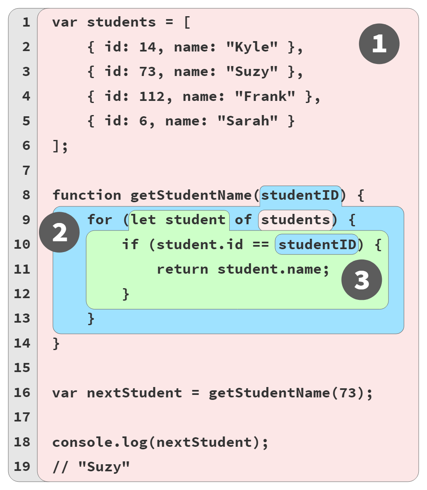

# You Don't Know JS Yet: Scope & Closures - readaptation by handgull

# Capitolo 2: Illustrare l'Ambito Lessicale
Nel Capitolo 1 abbiamo esplorato come viene determinato l'ambito durante la compilazione del codice, un modello chiamato "ambito lessicale". Il termine "lessicale" si riferisce alla prima fase della compilazione (lexing/parsing).

Per ragionare correttamente sui nostri programmi, è importante avere una solida base concettuale su come funziona l'ambito. Se ci basiamo su congetture e intuizioni, potremmo accidentalmente ottenere le risposte corrette alcune volte, ma molte altre volte saremo lontani dal vero risultato. Questo non è un metodo per avere successo.

Come accadeva tanto tempo fa nelle lezioni di matematica alle elementari, ottenere la risposta corretta non è sufficiente se non mostriamo i passaggi corretti per arrivarci! Dobbiamo costruire modelli mentali accurati e utili come fondamento per procedere.

Questo capitolo illustrerà l'*ambito* con diverse metafore. L'obiettivo qui è *pensare* a come il tuo programma viene gestito dal motore JS in modi che si allineano più strettamente a come il motore JS funziona effettivamente.

## Biglie, Secchielli e Bolle... Oh mio!
Una metafora che ho trovato efficace per comprendere lo scope è il classico esempio delle biglie colorate suddivise nei secchielli corrispondenti ai loro colori.

Immagina di imbatterti in un mucchio di biglie e notare che sono tutte colorate di rosso, blu o verde. Ordiniamo tutte le biglie, lasciando cadere quelle rosse in un secchiello rosso, quelle verdi in un secchiello verde e quelle blu in un secchiello blu. Dopo averle ordinate, quando hai bisogno di una biglia verde, sai già che devi andare nel secchiello verde per trovarla.

In questa metafora, le biglie sono le variabili nel nostro programma. I secchielli sono gli scope (funzioni e blocchi), a cui assegniamo concettualmente colori individuali per scopi di discussione. Il colore di ogni biglia è quindi determinato dallo scope colore in cui abbiamo trovato la biglia originariamente creata.

Annotiamo l'esempio del programma in esecuzione dal Capitolo 1 con etichette di colori per gli scope:

```js
// scope esterno/globale: ROSSO

var students = [
    { id: 14, name: "Kyle" },
    { id: 73, name: "Suzy" },
    { id: 112, name: "Frank" },
    { id: 6, name: "Sarah" }
];

function getStudentName(studentID) {
    // scope della funzione: BLU

    for (let student of students) {
        // scope del loop: VERDE

        if (student.id == studentID) {
            return student.name;
        }
    }
}

var nextStudent = getStudentName(73);
console.log(nextStudent);   // Suzy
```

Abbiamo designato tre colori di scope con commenti nel codice: ROSSO (scope globale esterno), BLU (scope della funzione `getStudentName(..)`) e VERDE (scope del ciclo `for`). Ma potrebbe comunque essere difficile riconoscere i confini di questi secchielli guardando un elenco di codice.

La Figura 2 aiuta a visualizzare i confini degli scope disegnando bolle colorate (aka, secchielli) intorno a ciascuno:

<figure>
    
    <figcaption><em>Fig. 2: Bolle di Scope Colorate</em></figcaption>
</figure>

1. Bolla 1 (ROSSO) racchiude lo scope globale, che contiene tre identificatori/variabili: `students` (riga 1), `getStudentName` (riga 8) e `nextStudent` (riga 16).

2. Bolla 2 (BLU) racchiude lo scope della funzione `getStudentName(..)` (riga 8), che contiene un solo identificatore/variabile: il parametro `studentID` (riga 8).

3. Bolla 3 (VERDE) racchiude lo scope del ciclo for (riga 9), che contiene un solo identificatore/variabile: `student` (riga 9).

| NOTA: |
| :--- |
| Tecnicamente, il parametro `studentID` non è esattamente nello scope BLU(2). Risolveremo questa confusione in "Scope Impliciti" nell'Appendice A. Per ora, è abbastanza vicino etichettare `studentID` come una biglia BLU(2).

Le bolle di scope sono determinate durante la compilazione in base a dove sono scritte le funzioni/gli scope, l'annidamento tra di loro e così via. Ogni bolla di scope è completamente contenuta nella sua bolla di scope genitore: uno scope non è mai parzialmente in due scope esterni diversi.

Ogni biglia (variabile/identificatore) è colorata in base al secchiello (bolla) in cui è dichiarata, non al colore dello scope da cui può essere accessa (ad esempio, `students` alla riga 9 e `studentID` alla riga 10).

| NOTA: |
| :--- |
| Ricordiamo che abbiamo affermato nel Capitolo 1 che `id`, `name` e `log` sono tutte proprietà, non variabili; in altre parole, non sono biglie nei secchielli, quindi non vengono colorate seguendo le regole di cui stiamo discutendo in questo libro. Per capire come vengono gestiti questi accessi alle proprietà, consulta il terzo libro della serie, Oggetti e Classi.

Mentre il motore JavaScript elabora un programma (durante la compilazione) e trova una dichiarazione per una variabile, chiede essenzialmente: "In quale secchiello (bolla o secchio) colore mi trovo attualmente?" La variabile è designata con lo stesso colore, il che significa che appartiene a quel secchiello/bolla.

Il secchiello VERDE(3) è completamente annidato dentro al secchiello BLU(2), e allo stesso modo il secchiello BLU(2) è completamente annidato nel secchiello ROSSO(1). Gli scope possono annidarsi tra di loro come mostrato, a qualsiasi profondità di annidamento necessaria per il tuo programma.

I riferimenti (non dichiarazioni) alle variabili/identificatori sono consentiti se c'è una dichiarazione corrispondente nello scope corrente o in uno qualsiasi degli scope sopra/fuori dallo scope corrente, ma non con dichiarazioni da scope inferiori/annidati.

Un'espressione nel secchiello ROSSO(1) ha accesso solo alle biglie ROSSO(1), non a quelle BLU(2) o VERDE(3). Un'espressione nel secchiello BLU(2) può fare riferimento a biglie BLU(2) o ROSSO(1), non a VERDE(3). E un'espressione nel secchiello VERDE(3) ha accesso alle biglie ROSSO(1), BLU(2) e VERDE(3).

Possiamo concepire il processo di determinazione di questi colori di biglie non dichiarative durante l'esecuzione come una ricerca. Poiché il riferimento alla variabile `students` nello statement del ciclo `for` alla riga 9 non è una dichiarazione, non ha un colore. Quindi chiediamo al secchiello BLU(2) corrente se ha una biglia con quel nome. Poiché non l'ha, la ricerca continua con lo scope esterno/contenitore successivo: ROSSO(1). Il secchiello ROSSO(1) ha una biglia con nome `students`, quindi il riferimento alla variabile del ciclo è determinato essere una biglia ROSSO(1).

L'istruzione `if (student.id == studentID)` alla riga 10 è determinata allo stesso modo a fare riferimento a una biglia VERDE(3) chiamata `student` e a una biglia BLU(2) chiamata `studentID`.

| NOTA: |
| :--- |
| Il motore JS generalmente non determina questi colori di biglie durante l'esecuzione; la "ricerca" qui è un dispositivo retorico per aiutarti a comprendere i concetti. Durante la compilazione, la maggior parte o tutti i riferimenti alle variabili corrisponderanno già ai secchielli di scope conosciuti, quindi il loro colore è già determinato e memorizzato con ciascun riferimento alla biglia per evitare ricerche non necessarie durante l'esecuzione del programma. Maggiori dettagli su questa sottigliezza nel Capitolo 3.

I punti chiave delle biglie e dei secchielli (e bolle!):

* Le variabili sono dichiarate in scope specifici, che possono essere pensati come biglie colorate da secchielli dello stesso colore.

* Qualsiasi riferimento a una variabile che appare nello scope in cui è dichiarata o appare in scope annidati più profondi, sarà etichettato come una biglia dello stesso colore, a meno che uno scope intermedio "eclissi" la dichiarazione della variabile; vedi "Eclissi" nel Capitolo 3.

* La determinazione dei secchielli colorati e delle biglie che contengono avviene durante la compilazione. Queste informazioni vengono utilizzate per "ricerche" delle variabili (colore delle biglie) durante l'esecuzione del codice.
